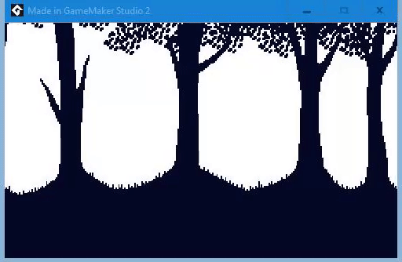

# Sciter-GameMaker

Trying to embed a Sciter window into a GameMaker Studio 2 game window.

## GameMaker Script

This is executed in the room creation code of the first (and only) room in the test project.

```gml
var foo = external_define(
	"sciter_gamemaker.dll", 
	"foo", 
	dll_cdecl,
	ty_real, 
	1, 
	ty_string
);
var handle = window_handle();
var handle_as_hex_string = string(handle);
external_call(foo, handle_as_hex_string);
```

Nothing happens, except the game window is displayed which consists of just a horizontally scrolling image.

## Preview

